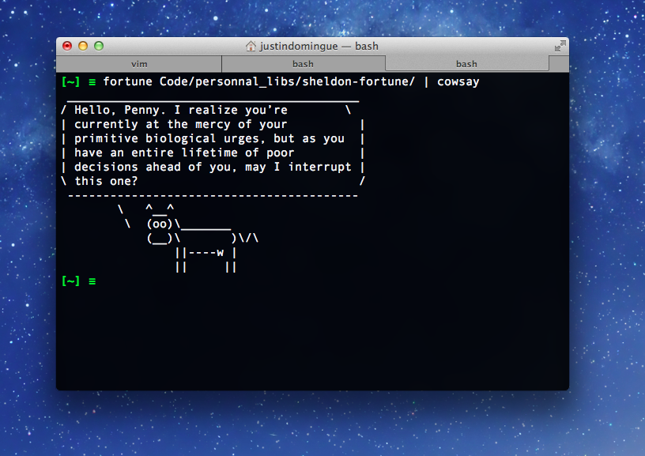

Sheldon Fortune
===============

A list of funny Sheldon Cooper quotes taken from The Big Bang Theory.

How to use
==========

First, make you sure you have `fortune` installed. On OSX, use `brew install fortune` to install it (install `brew` first). On Linux, use your favorite package manager to install.

Then, clone or download my zipped repo and extract the content (eg. to ~/Documents/Sheldon/). Then, run

    fortune ~/Documents/Sheldon

Use with `cowsay` for even more fun!

Misc
====

I like to add

    fortune sheldon-dir | cowsay

to my `.bashrc` so that I get a quote every time I open a new terminal.

Todo
====

* add more quotes!

